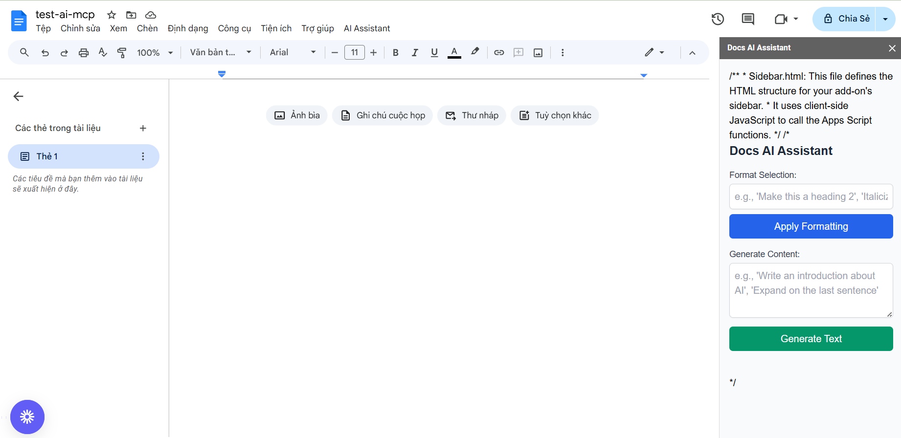

# FOR GOOGLE DOC - AN AI AGENT WORD EDITOR 
## in the future, we may add MCP

## .env
```bash
GEMINI_API_KEY="already got this"
GOOGLE_DOCS_AUTH_TOKEN="YOUR_TEMPORARY_GOOGLE_DOCS_ACCESS_TOKEN_HERE"
FLASK_APP=app.py
```

## FILE STRUCTURE:
|----venv
|----.env
|----app.py
|----client_secret.json
|----readme.md
|----requirement.txt

## GOOGLE_DOCS_AUTH_TOKEN set up
This setup uses environment variables, which is a good practice for sensitive information like API keys.

Where to Get GOOGLE_DOCS_AUTH_TOKEN
The GOOGLE_DOCS_AUTH_TOKEN is an OAuth 2.0 access token that grants your backend temporary permission to interact with a user's Google Docs. For development and testing, you can obtain a temporary one using the Google OAuth 2.0 Playground.

Important: This token is temporary (usually expires in about an hour) and is only for local development and testing. For a deployed, production-ready add-on, you'll need to implement a proper OAuth 2.0 flow within your Google Apps Script and backend to get and refresh tokens securely on behalf of users.

Here are the step-by-step instructions to get a temporary GOOGLE_DOCS_AUTH_TOKEN:

Go to the Google OAuth 2.0 Playground:

Open your web browser and navigate to: https://developers.google.com/oauthplayground/
Select & Authorize APIs (Step 1):

In the "Step 1: Select & authorize APIs" section on the left sidebar:
Under "Input your own scopes," type or paste the following scopes, one by one, and press Enter after each to add them:
https://www.googleapis.com/auth/documents
https://www.googleapis.com/auth/drive.readonly
Click the "Authorize APIs" button.

## FRONTEND
### open google doc and post
http://127.0.0.1:5000 is the address where your backend is listening for requests.
The * Debug mode: on line is useful for development as it gives you detailed error messages.
Next Steps:
With your backend running, the next crucial step is to update your Google Apps Script frontend with this local URL (http://127.0.0.1:5000).

Go back to your Google Apps Script project for the Docs Add-on.
#### In Code.gs (extesion (mục tiện ích) on toolbar -> click add Script)

```bash
**
 * @file Code.gs
 * @description Google Apps Script for a Google Docs AI Add-on frontend.
 * Handles UI, document content retrieval, and communication with external backend.
 */

/**
 * onOpen trigger: Runs automatically when a user opens a Google Doc.
 * Creates a custom menu in the Google Docs UI.
 */
function onOpen() {
  // Get the active UI instance for Google Docs.
  const ui = DocumentApp.getUi();

  // Create a custom menu named "AI Assistant" with actions.
  ui.createMenu('AI Assistant')
      .addItem('Open AI Sidebar', 'showSidebar') // Menu item to open the sidebar.
      .addSeparator() // Adds a visual separator in the menu.
      .addItem('Format Selection', 'formatSelection') // Menu item to format selected text.
      .addItem('Generate Content Here', 'generateContentAtCursor') // Menu item to generate content at cursor.
      .addToUi(); // Adds the menu to the Google Docs UI.
}

/**
 * showSidebar: Opens a custom sidebar in the Google Docs UI.
 * This sidebar would contain the user interface elements (buttons, text areas)
 * for interacting with your AI.
 */
function showSidebar() {
  // Create an HTML output from a file named 'Sidebar.html'.
  // This file would define your sidebar's UI (HTML, CSS, JS).
  const html = HtmlService.createHtmlOutputFromFile('Sidebar')
      .setTitle('Docs AI Assistant'); // Set the title of the sidebar.

  // Show the sidebar in the Google Docs UI.
  DocumentApp.getUi().showSidebar(html);
}

/**
 * formatSelection: A server-side function called by the client-side (Sidebar.html) JavaScript.
 * It retrieves the selected text, sends it to the Python backend for AI processing,
 * and then applies the suggested formatting.
 *
 * @param {string} prompt The user's instruction for formatting.
 * @returns {string} A message indicating success or failure.
 */
function formatSelection(prompt) {
  const doc = DocumentApp.getActiveDocument();
  const selection = doc.getSelection();

  if (!selection) {
    // If no text is selected, return an error message.
    return "Please select some text to format.";
  }

  // Get the range of the selected text.
  const selectedRange = selection.getRangeElements();
  if (selectedRange.length === 0) {
    return "No text selected.";
  }

  // For simplicity, we'll assume the first element is the main text.
  // In a real app, you'd iterate through all elements.
  const textElement = selectedRange[0].getElement();
  const selectedText = textElement.asText().getText();
  const startIndex = textElement.getStartOffsetInclusive();
  const endIndex = textElement.getEndOffsetInclusive();

  // IMPORTANT: For a production add-on, you must handle OAuth2 authentication
  // to call external APIs securely. This example uses a placeholder.
  // You would typically use `UrlFetchApp` to send a POST request to your Python backend.
  // The backend URL needs to be publicly accessible (e.g., deployed on Google Cloud Run/App Engine).

  const backendUrl = 'YOUR_PYTHON_BACKEND_URL_HERE/format'; // Replace with your actual backend URL
  const payload = {
    documentId: doc.getId(), // Pass the document ID to the backend.
    selectedText: selectedText,
    startIndex: startIndex,
    endIndex: endIndex,
    prompt: prompt,
    // Add other relevant document context if needed (e.g., surrounding text)
  };

  try {
    // Make an HTTP POST request to your Python backend.
    const response = UrlFetchApp.fetch(backendUrl, {
      method: 'post',
      contentType: 'application/json',
      payload: JSON.stringify(payload),
      muteHttpExceptions: true // Don't throw exceptions for HTTP errors, handle them manually.
    });

    const responseCode = response.getResponseCode();
    const responseBody = response.getContentText();

    if (responseCode === 200) {
      const result = JSON.parse(responseBody);
      // The backend has already applied the formatting via Docs API,
      // so just return a success message.
      return "Formatting applied successfully!";
    } else {
      console.error(`Backend error: ${responseCode} - ${responseBody}`);
      return `Error from AI: ${responseBody}`;
    }
  } catch (e) {
    console.error(`Error calling backend: ${e.message}`);
    return `An error occurred: ${e.message}`;
  }
}

/**
 * generateContentAtCursor: A server-side function called by the client-side.
 * It retrieves the cursor position (or selection), sends it to the Python backend
 * for AI text generation, and then inserts the generated text.
 *
 * @param {string} prompt The user's instruction for content generation.
 * @returns {string} A message indicating success or failure.
 */
function generateContentAtCursor(prompt) {
  const doc = DocumentApp.getActiveDocument();
  const cursor = doc.getCursor();

  if (!cursor) {
    return "Please place your cursor where you want to generate content.";
  }

  // Get the element at the cursor position and its offset.
  const element = cursor.getElement();
  const offset = cursor.getOffset();

  // For content generation, it's good to provide some surrounding context.
  // Get the paragraph where the cursor is.
  let surroundingText = '';
  if (element.getType() === DocumentApp.ElementType.PARAGRAPH) {
    surroundingText = element.asParagraph().getText();
  } else if (element.getParent().getType() === DocumentApp.ElementType.PARAGRAPH) {
    surroundingText = element.getParent().asParagraph().getText();
  }

  const backendUrl = 'YOUR_PYTHON_BACKEND_URL_HERE/generate'; // Replace with your actual backend URL
  const payload = {
    documentId: doc.getId(),
    cursorIndex: doc.getBody().getText().length, // A simpler approach: insert at end.
                                                 // For precise cursor insertion, you'd need to
                                                 // calculate the absolute index.
    prompt: prompt,
    surroundingText: surroundingText // Provide context to the LLM.
  };

  try {
    const response = UrlFetchApp.fetch(backendUrl, {
      method: 'post',
      contentType: 'application/json',
      payload: JSON.stringify(payload),
      muteHttpExceptions: true
    });

    const responseCode = response.getResponseCode();
    const responseBody = response.getContentText();

    if (responseCode === 200) {
      const result = JSON.parse(responseBody);
      // The backend has already inserted the text via Docs API.
      return "Content generated and inserted successfully!";
    } else {
      console.error(`Backend error: ${responseCode} - ${responseBody}`);
      return `Error from AI: ${responseBody}`;
    }
  } catch (e) {
    console.error(`Error calling backend: ${e.message}`);
    return `An error occurred: ${e.message}`;
  }
}

```

#### then add a new html file in that too (Sidebar.html)
```bash
/**
 * Sidebar.html: This file defines the HTML structure for your add-on's sidebar.
 * It uses client-side JavaScript to call the Apps Script functions.
 */
<!DOCTYPE html>
<html>
  <head>
    <base target="_top">
    <link href="https://cdn.jsdelivr.net/npm/tailwindcss@2.2.19/dist/tailwind.min.css" rel="stylesheet">
    <style>
      body { font-family: 'Inter', sans-serif; }
    </style>
  </head>
  <body class="p-4 bg-gray-50">
    <h1 class="text-xl font-bold mb-4 text-gray-800">Docs AI Assistant</h1>

    <div class="mb-4">
      <label for="formatPrompt" class="block text-sm font-medium text-gray-700 mb-1">Format Selection:</label>
      <input type="text" id="formatPrompt" placeholder="e.g., 'Make this a heading 2', 'Italicize all quotes'"
             class="w-full p-2 border border-gray-300 rounded-md shadow-sm focus:ring-blue-500 focus:border-blue-500">
      <button onclick="sendFormatRequest()"
              class="mt-2 w-full bg-blue-600 text-white py-2 px-4 rounded-md hover:bg-blue-700 focus:outline-none focus:ring-2 focus:ring-blue-500 focus:ring-offset-2">
        Apply Formatting
      </button>
    </div>

    <div class="mb-4">
      <label for="generatePrompt" class="block text-sm font-medium text-gray-700 mb-1">Generate Content:</label>
      <textarea id="generatePrompt" rows="3" placeholder="e.g., 'Write an introduction about AI', 'Expand on the last sentence'"
                class="w-full p-2 border border-gray-300 rounded-md shadow-sm focus:ring-blue-500 focus:border-blue-500"></textarea>
      <button onclick="sendGenerateRequest()"
              class="mt-2 w-full bg-green-600 text-white py-2 px-4 rounded-md hover:bg-green-700 focus:outline-none focus:ring-2 focus:ring-green-500 focus:ring-offset-2">
        Generate Text
      </button>
    </div>

    <div id="statusMessage" class="mt-4 p-3 rounded-md text-sm"></div>

    <script>
      // Function to display status messages in the sidebar.
      function showStatus(message, isError = false) {
        const statusDiv = document.getElementById('statusMessage');
        statusDiv.textContent = message;
        statusDiv.className = `mt-4 p-3 rounded-md text-sm ${isError ? 'bg-red-100 text-red-700' : 'bg-blue-100 text-blue-700'}`;
      }

      // Calls the server-side Apps Script function to format selected text.
      function sendFormatRequest() {
        const prompt = document.getElementById('formatPrompt').value;
        if (!prompt) {
          showStatus("Please enter a formatting prompt.", true);
          return;
        }
        showStatus("Applying formatting...");
        // Call the server-side function (Apps Script) to process the request.
        google.script.run
          .withSuccessHandler(function(response) {
            showStatus(response);
          })
          .withFailureHandler(function(error) {
            showStatus("Error: " + error.message, true);
          })
          .formatSelection(prompt);
      }

      // Calls the server-side Apps Script function to generate content.
      function sendGenerateRequest() {
        const prompt = document.getElementById('generatePrompt').value;
        if (!prompt) {
          showStatus("Please enter a content generation prompt.", true);
          return;
        }
        showStatus("Generating content...");
        // Call the server-side function (Apps Script) to process the request.
        google.script.run
          .withSuccessHandler(function(response) {
            showStatus(response);
          })
          .withFailureHandler(function(error) {
            showStatus("Error: " + error.message, true);
          })
          .generateContentAtCursor(prompt);
      }
    </script>
  </body>
</html>
```


#### Final Connection: Update the Backend URL in Code.gs
```bash
JavaScript

const backendUrl = 'YOUR_PYTHON_BACKEND_URL_HERE/format';
// ...
const backendUrl = 'YOUR_PYTHON_BACKEND_URL_HERE/generate';
```
Change them to:

```bash
JavaScript

const backendUrl = 'http://127.0.0.1:5000/format';
// ...
const backendUrl = 'http://127.0.0.1:5000/generate';
```   
Save the Code.gs file in Apps Script.
Now you can open your Google Doc, open the AI Assistant sidebar, and try making a request! Your Apps Script frontend will send requests to your locally running Python backend.


## localhost wont run : add gccloud
https://cloud.google.com/sdk/docs/install#windows

// download and run (all defaults)

#### run this

Find your Google Cloud Project ID:

Go to your Google Cloud Console: console.cloud.google.com.
At the very top of the page, next to the Google Cloud logo, you'll see a dropdown with your current project name. Click on it.
In the "Select a project" dialog, find your project (e.g., "Docs AI Assistant"). Below its name, you'll see its Project ID (it's usually a lowercase string with hyphens, like docs-ai-assistant-123456). Copy this Project ID.

```bash
gcloud run deploy docs-ai-backend `
  --source . `
  --region us-central1 `
  --allow-unauthenticated `
  --set-env-vars GEMINI_API_KEY="...." `
  --set-env-vars GOOGLE_DOCS_AUTH_TOKEN="....."`
  --project YOUR_PROJECT_ID 
```

#### will show error: so do that
```bash     
ERROR: (gcloud.run.deploy) You do not currently have an active account selected.
Please run:

  $ gcloud auth login

to obtain new credentials.

If you have already logged in with a different account, run:

  $ gcloud config set account ACCOUNT

to select an already authenticated account to use.
```


#### and set up billing, i aint doing none of that bullshhyyyt, dont have money though
